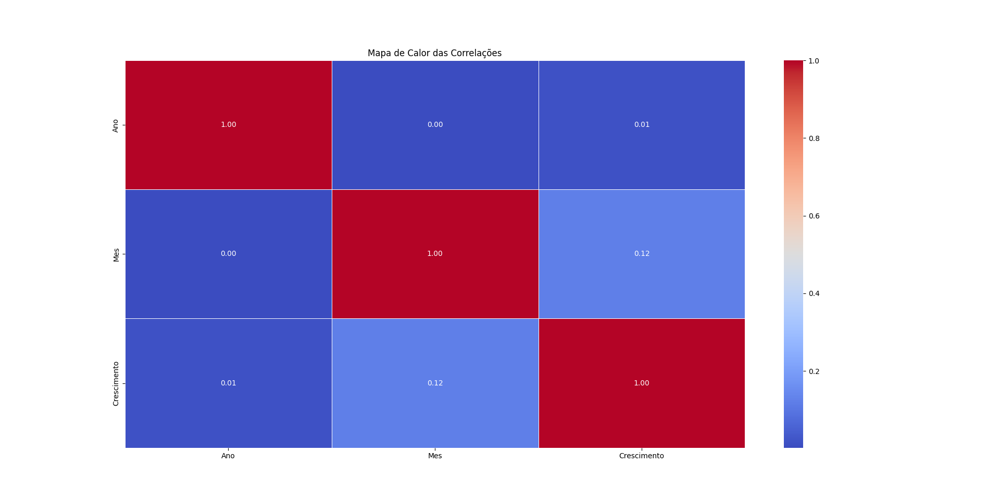

# Análise Explorátoria
O processo de Análise Explorátoria envolve analisar os dados do dataset, para entender os valores minimos, máximos, médias, desvio padrão, percentis,  dentre outras métricas que podemos calcular. Isso ajuda a entender os valores de cada coluna, para termos uma notação do nosso cenário que estamos explorando.

Muitas vezes, se pode observar valores extremos, e possivelmente outliers, olhando os valores minimos, máximos, onde poderiamos perceber informações que não fariam sentido, por exemplo, valores negativos em certas colunas que deveriam ser apenas positivas.

## Lendo o dataset com o pandas
```python
import pandas as pd

dataset = pd.read_csv('../criando-dataset/datasets/crescimento-soja.csv', sep=';')
```
<code>

## Descrevendo o dataset
```python
dataset.describe();
```

### Descrição do dataset dada pelo pandas:
```text
        Ano          Mes         Crescimento
count  1805.000000  1805.000000  1802.000000
mean   2022.496399     6.398892    69.758602
std       1.709052     3.286301    44.412608
min    2020.000000     1.000000    30.000000
25%    2021.000000     3.000000    40.000000
50%    2022.000000     6.000000    49.000000
75%    2024.000000     9.000000    95.000000
max    2025.000000    12.000000  1024.000000
```

Isso permite visualizar os minimos, máximos e média de cada Coluna, o que é muito util!

## Ver o tamanho do dataset
```python
dataset.shape;
```

### Descrição do tamanho do dataset dada pelo pandas:
```python
(1805, 4)
```

Ou seja, esse meu dataset tem 1805 linhas e 4 colunas.

## Vendo se tem valores negativos na coluna Crescimento
O método describe já mostrou isso. Mais quero garantir que não haja valores negativos.

```python
print( dataset[ dataset['Crescimento'] < 0 ].count()['Crescimento'].sum() )
```

### Resultado
```text
0
```

Ou seja, na coluna Crescimento não existe nenhum valor negativo. E não deveria ter mesmo!

## Vendo se tem valores NaN(valores faltando) em alguma das colunas
As vezes, as colunas podem ter valores faltando. E isso precisa ser tratado de alguma forma para não causar problemas na hora de treinar modelos de Machine Learning, ou de fazer análises.

```python
# Ver se tem valores NaN e contar quantos são, por coluna
quantidade_nan_por_coluna = dataset.isna().sum()
print(quantidade_nan_por_coluna)
```

```text
Ano            0
Mes            0
Estacao        0
Crescimento    3
dtype: int64
```

**Isso significa que na coluna Crescimento tem 3 valores NaN.**
Para tratar isso podemos usar a média da coluna, ou usar regressão linear na coluna, ou colocar tudo zero, ou mesmo remover as amostras que tem NaN.

# Vendo se tem Outliers(valores extremos no Dataset)
Isso é importante. Outliers são amostras que tem colunas com valores extremos ou absurdos, que mesmo que não estejam errados, ainda assim fogem do padrão. Por exemplo, valores muito altos, ou muito baixos que o normal. Ou seja que amostras que tem colunas com valores que fogem do padrão do dataset.

## Como verificar se tem Outliers no Dataset?
Existem duas formas de verificar a presença de Outliers: Podemos usar Gráfico de Box Plot: Nesse gráfico de caixa, os Outliers vão aparece sempre fora da zona do gráfico. Ou também podemos usar testes estatísticos, como o Z-Score.

## O que fazer? E por que?
Outliers devem ser removidos, para não causar problemas na hora de treinar modelos de Machine Learning, ou de fazer análises. Pois os Outliers causam instabilidade nos modelos, distorcendo o padrão, e tambem exageram e distorcem gráficos.

# Usando Gráficos para entender melhor o dataset
Podemos criar diversos tipos de Gráficos para exibir os dados do dataset. Tanto gráficos de barra, quanto gráficos de pizza, histogramas, dispersão, dentre outros. Aqui vou usar Gráfico de barras, Dispersão, Box Plot e Histograma.

## OS Histogramas
Também podemos usar histogramas para visualizar os dados. Histogramas são gráficos de frequências, ou seja, gráficos que mostram com que frequência os valores aparecem dentro de uma coluna específica do dataset. Isso é semelhante à contagem de vezes que o valor aparece(frequencia), e também ao gráfico de barras, mas a diferença é que, no histograma, ele tem diversos intervalos de frequência, chamados de `bins`. Em vez de contar quantas vezes cada valor numérico apareceu na coluna, o histograma faz algo um pouco melhor: ele conta quantas vezes os valores daquela coluna aparecem dentro de cada intervalo (ou bin). Por exemplo, podemos criar um histograma para contar a frequência das idades: `[28, 20, 22, 25, 28, 22, 23]`, e o histograma vai determinar os `bins` e criar faixas como: de `20 a 22`, `de 23 a 25`, `de 26 a 28`, etc. Ele vai contar quantas vezes os valores caem nesses intervalos e, no final, teremos um gráfico que mostra, por exemplo, que no intervalo de `20 a 22` houve tantas pessoas, no intervalo de `23 a 25` houve tantas, e no intervalo de `26 a 28` houve tantas.

Abaixo eu mostro um exemplo de histograma:

## Histograma com as Frequencias de Crescimento


## Gráfico do Crescimento em cada Mês de 2020 a 2025


## Gráfico do Crescimento em cada Estação do Ano, de 2020 a 2025


## Gráfico do Crescimento ao longo do tempo de 2020 a 2025


# Conceito de Médias moveis
As médias móveis são calculadas a partir de uma média, mas não de todo o conjunto de dados. Em vez disso, é uma média de um período específico, e essa média pode "mover-se", ou seja, ela muda conforme as amostras usadas para o cálculo da média. Esse "movimento" acontece por meio de um conceito chamado de "janelas deslizantes". Imagine uma "janela retangular" de tamanho fixo, que tem um `início` e um `fim`. Dentro dessa janela, pegamos todas as amostras dentro desse intervalo de índices: do índice do `início` até o índice do `fim`, e calculamos a média. 

Depois, "movemos" essa janela um passo para a direita, ou seja, o `início` e o `fim` são incrementados em 1. Assim, as amostras escolhidas vão ser as que estão no intervalo entre `início + 1` até `fim + 1`, e calculamos a nova média. Dessa forma, as amostras mais antigas vão ficando para trás e deixam de ser usadas no cálculo da média móvel. Existem diferentes tipos de médias móveis, mas não vou entrar em detalhes sobre isso.

# Padrões sacionais e temporais e uso de Médias moveis
Padrões sacionais são aqueles que se repetem em épocas especificas, por exemplo, em meses especificos.
E padrões temporais em geral são padrões que levam em conta o tempo.

Podemos identificar possíveis tendencias sacionais e temporais, analisando o crescimento das plantas ao longo do tempo. Por exemplo, veja o gráfico abaixo:


**EXPLICAÇÂO: Esse primeiro gráfico, observamos um padrão de crescimento das plantas que se repete: um some e desce no crescimento das plantas, por assim dizer**

Para ficar mais fácil de visualizarmos isso, podemos usar médias móveis, e visalizar a tendencia de crescimento dos valores ao longo do tempo. Veja isso no segundo gráfico abaixo:


**EXPLICAÇÂO: Igual no gráfico anterior, nesse segundo gráfico, observamos um padrão de aumento no tempo de crescimento das plastas que se repete: um some e desce no tempo de crescimento das plantas, por assim dizer. Porém, nesse segundo gráfico, usei médias móveis para calcular as tendencias de crescimento.**

Tambem é possivel isolar apenas um ano. Por exemplo, eu tambem criei um gráfico do Crescimento em cada mes, mais olhando apeneas o ano de 2020.

## Gráfico do Crescimento em cada Mês apenas de 2020


## Detectando a presença de Outliers usando Gráficos Box Plot


**EXPLIAÇÂO: Podemos usar Gráfico de Box Plot: Nesse gráfico de caixa, os Outliers vão aparece sempre fora da zona do gráfico, assim como eu destaquei em vermelho no gráfico acima.**

# ENCONTRANDO CORRELAÇÂO ENTRE AS COLUNAS
Correlação é o quanto os valores de uma determinada coluna estão relacionados com os valores de uma outra coluna.
Existem correlações positivas, neutras e negativas, e em diferentes niveis. Isso claro, com respeito a aumento ou diminuição de valores.
**A correlação é calculada sempre comparando duas colunas.**

## Faixa de valores possiveis da correlação
 - 0: Nenhuma correlação, nada acontece
 - 1: Correlação forte positiva, a medida que uma coluna aumenta, a outra tambem aumenta
 - -1: Correlação negativa forte, a medidaa que uma coluna aumenta, a outra diminui.

**Os valores podem variar entre -1 a 1. O valor da correlação vai ser sempre dentro dessa faixa de valores.**

## Interpretação de correlação
Por exemplo, se uma determinada coluna tem correlação positiva forte com outra coluna, isso significa que, a medida que essa coluna aumenta, a outra tambem aumenta junto. 

Caso contrário, se uma determinada coluna tem correlação negativa forte com outra coluna, isso significa que, a medida que essa coluna aumenta, a outra tambem diminui, e vice-versa.

**IMPORTANTE: A ordem das colunas não importa, o valor da correlação será o mesmo**

A correlação é muito útil para selecionar quais colunas são mais relevantes, e para poder saber quais colunas usar para treinar um modelo de Machine Learning. Com ela podemos descartar colunas irrelevantes, ou não tão relevantes.

**IDEIA: Voce pode calcular a correlação com o dataset inteiro como eu fiz. Ou então, voce também pode fatiar o dataset em partes menores, ou seja, em grupos menores de amostras, e calcular a correlação de cada grupo. Isso pode dar uma visão melhor.**

## Como calcular
Para calcular a correlação, existem duas formas principais:

 - (1) Usando Gráficos de Dispersão: Nesse método, nós fazer um Gráfico de Dispersão entre as colunas X e Y, e olhamos se existe uma relação de crescimento vísivel no gráfico, por exemplo, se houver alguma correlação, os eixos X e Y vão estar formando algum tipo de reta linear, para alguma direção, e mesmo com algumas variações, vai existir um padrão claramente visivel. Porém, se não houver nenhuma correlação entre as colunas X e Y escolhidas, os pontos no gráfico vão estar distantes, ou distribuidos de forma bem aleatoria, sem um padrão claro.

 - (2) Usando cálculos: Por exemplo, podemos usar o método da correlação de Pearson, que faz a correlação entre dois vetores X e Y diretamente(ou seja, os valores das colunas X e Y), com isso, retorna um valor entre -1 e 1, que segue a mesma lógica da **Interpretação de correlação** que mostrei acima. 

## Gráfico de Cores para mostrar as Correlações entre duas colunas


**EXPLICAÇÂO: Nesse gráfico, podemos ver que o Mes e o Ano aumentam o Tempo de Crescimento.**