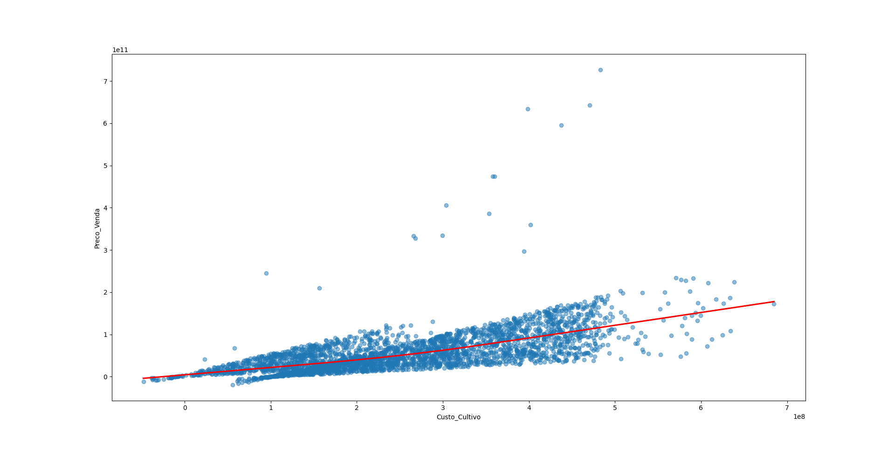
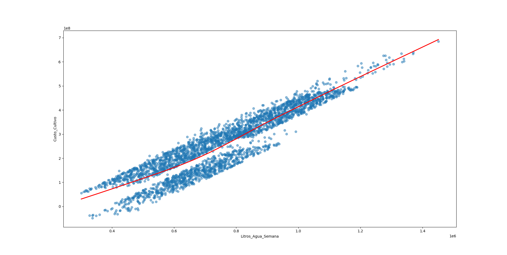
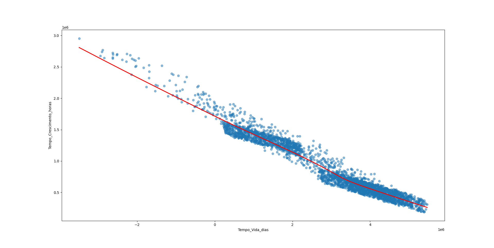
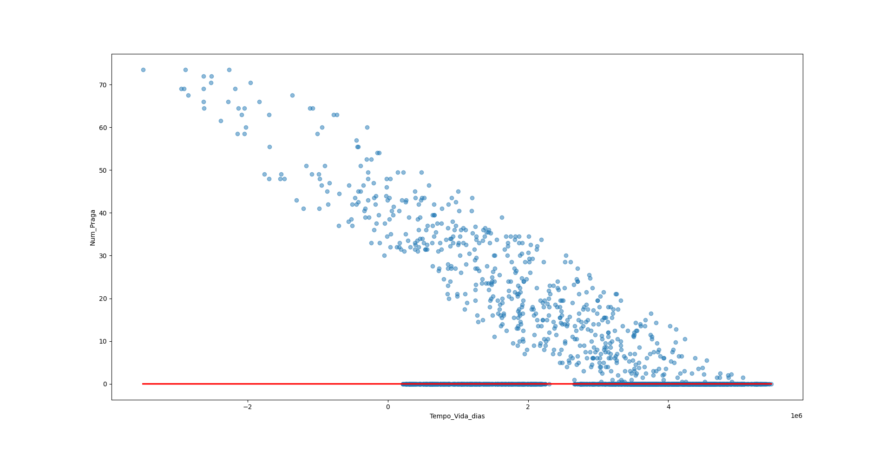
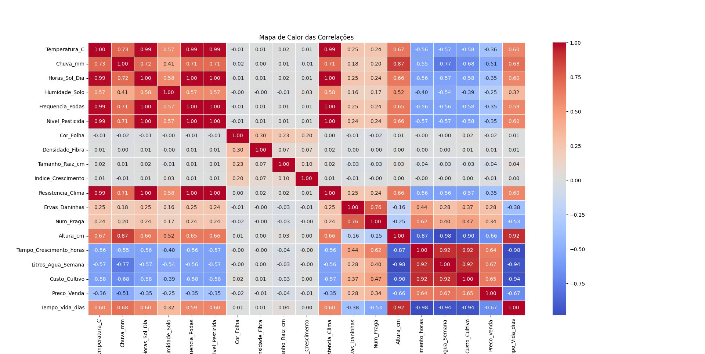

# Análise Explorátoria
O processo de Análise Explorátoria envolve analisar os dados do dataset, para entender os valores minimos, máximos, médias, desvio padrão, percentis,  dentre outras métricas que podemos calcular. Isso ajuda a entender os valores de cada coluna, para termos uma notação do nosso cenário que estamos explorando.

Muitas vezes, se pode observar valores extremos, e possivelmente outliers, olhando os valores minimos, máximos, onde poderiamos perceber informações que não fariam sentido, por exemplo, valores negativos em certas colunas que deveriam ser apenas positivas.

## Análise que fiz

### Colunas
<pre>
<code>python .\analise-basica.py</code>
</pre>

### PRIMEIRAS LINHAS DO DATASET (PRIMEIRAS AMOSTRAS):
<pre>
         Data Estacao_Ano Tipo_Planta Tipo_Solo  Temperatura_C    Chuva_mm  ...  Tempo_Crescimento_horas  Litros_Agua_Semana   Saude  Custo_Cultivo   Preco_Venda  Tempo_Vida_dias
0  2020-01-01     Inverno      Tomate   Arenoso    -142.821783  -33.501388  ...             1.283856e+06        8.708987e+05  Doente   3.662212e+08  3.405255e+10     1.208945e+06
1  2020-01-02     Inverno      Batata   Arenoso    -151.689624   -5.484920  ...             1.365897e+06        9.447499e+05  Doente   3.614611e+08  5.991073e+10     1.481377e+06
2  2020-01-03     Inverno        Soja  Argiloso    -132.360775 -127.990604  ...             1.612399e+06        1.184481e+06  Doente   4.951442e+08  1.121493e+11     2.123638e+05
3  2020-01-04     Inverno      Batata    Humoso    -142.504276  -91.031902  ...             1.404261e+06        9.914375e+05  Doente   4.305972e+08  8.103597e+10     6.788378e+05
4  2020-01-05     Inverno      Batata   Arenoso    -142.214795  -31.733914  ...             1.414649e+06        9.912731e+05  Doente   3.891334e+08  3.067634e+10     1.203701e+06

[5 rows x 24 columns]
``
</pre>

### Calculando métricas: média, valor minimo, valor máximo, etc...
<pre>
       Temperatura_C     Chuva_mm  Horas_Sol_Dia  Humidade_Solo  Frequencia_Podas  ...  Tempo_Crescimento_horas  Litros_Agua_Semana  Custo_Cultivo   Preco_Venda  Tempo_Vida_dias
count    3000.000000  3000.000000    3000.000000    2975.000000       3000.000000  ...             3.000000e+03        3.000000e+03   2.990000e+03  3.000000e+03     3.000000e+03
mean      -19.259555    74.953493     -35.918143      37.629188        -17.451000  ...             9.082197e+05        7.526629e+05   2.547188e+08  5.762628e+10     2.831568e+06
std        75.242972    89.638360      70.240618      24.922044         34.724192  ...             4.741514e+05        1.968979e+05   1.301182e+08  4.983617e+10     1.605434e+06
min      -159.971698  -129.919691    -157.965008     -20.390887        -80.000000  ...             1.880800e+05        3.012891e+05  -4.799936e+07 -1.915901e+10    -3.494612e+06
25%      -131.123078    17.606081    -150.332400      19.558552        -71.000000  ...             5.249483e+05        6.037221e+05   1.506293e+08  2.454040e+10     1.480987e+06
50%        19.734231    78.117093       3.394958      38.348396          1.000000  ...             7.166597e+05        7.373271e+05   2.396445e+08  4.773649e+10     3.261369e+06
75%        29.772989   143.589816       8.550532      57.561895          4.500000  ...             1.322659e+06        9.010537e+05   3.600127e+08  7.973994e+10     4.127169e+06
max        49.986731   249.160474      13.994681      81.486994          9.000000  ...             2.952793e+06        1.451219e+06   6.847427e+08  7.266834e+11     5.470994e+06

[8 rows x 19 columns]
</pre>

### Shape do dataset
<pre>
(3000, 24)
</pre>

**Ou seja, 3000 AMOSTRAS, com 24 colunas cada.**

### QTDE VALORES NULOS POR COLUNA
<pre>
Data                        0
Estacao_Ano                 0
Tipo_Planta                 0
Tipo_Solo                   0
Temperatura_C               0
Chuva_mm                    0
Horas_Sol_Dia               0
Humidade_Solo              25
Frequencia_Podas            0
Nivel_Pesticida             0
Cor_Folha                   0
Densidade_Fibra             0
Tamanho_Raiz_cm             0
Indice_Crescimento          0
Resistencia_Clima           0
Ervas_Daninhas              0
Num_Praga                   0
Altura_cm                   0
Tempo_Crescimento_horas     0
Litros_Agua_Semana          0
Saude                       0
Custo_Cultivo              10
Preco_Venda                 0
Tempo_Vida_dias             0
dtype: int64
</pre>

**NOTA: Isso vai precisar ser tratado.**

### QTDE AMOSTRAS DUPLICADAS
<pre>
0
</pre>

## QTDE VALORES NEGATIVOS NAS AMOSTRAS
<pre>
<code>python .\analise-qtde-valores-negativos.py</code>
</pre>

<pre>
Amostras com tempo de crescimento negativo: 0

Amostras com tempo de vida negativo: 94

Amostras com custo de cultivo negativo: 30

Amostras num pragas negativo: 0

Amostras Ervas Daninhas negativo: 0

Amostras com consumo de agua negativo: 0

Amostras com chuva negativo: 615
</pre>

**Isso vai precisar ser tratado.**

## Encontrando Outliers
Outliers são amostras que tem colunas com valores absurdos ou extremos, mesmo que estejam corretos.
Outliers em geral são valores que forem do padrão, e devem ser tratados ou removidos de alguma forma, para evitar problemas e confusões em analises futuras, ou ao treinar modelos de Machine Learning.

Para detectar Outliers podemos usar Gráficos do tipo Box Plot, ou então, usar alguns testes especificos como o Z-Score.

Nos scripts em python, usei três métodos: O Box Plot, e dois tipos de teste.

**IMPORTANTE: Nesse exemplo, eu propositalmente procurei Outliers na coluna `Preco_Venda`, por que eu criei esse dataset para ter Outliers nessa coluna, para ilustrar o conceito. Por isso, para não delongar muito a explicação, não irei procurar Outliers em outras colunas, pra poupar tempo. Porém para procurar Outliers, sempre precisamos definir em qual coluna queremos procurar, nesse exemplo, eu procuro Outliers na coluna `Preco_Venda`, como mencionado.**

<pre>
<code>python .\grafico-detectar-outliers.py</code>
</pre>

## Outliers encontrados
<pre>
             Data Estacao_Ano Tipo_Planta Tipo_Solo  Temperatura_C    Chuva_mm  ...  Tempo_Crescimento_horas  Litros_Agua_Semana   Saude  Custo_Cultivo   Preco_Venda  Tempo_Vida_dias
16    2020-01-17     Inverno     Cenoura   Arenoso    -133.417197 -124.832206  ...             1.513705e+06        1.086594e+06  Doente   4.733011e+08  1.659053e+11    303826.980192
39    2020-02-09     Inverno      Tomate   Siltoso    -153.119027  -84.867083  ...             1.543295e+06        1.112451e+06  Doente   4.505651e+08  1.634924e+11    634450.136454
43    2020-02-13     Inverno        Soja  Argiloso    -154.975267 -116.668034  ...             1.619168e+06        1.173523e+06  Doente   4.850349e+08  1.820402e+11    318145.278896
96    2020-04-06   Primavera      Tomate   Siltoso      19.681776   29.136721  ...             1.800786e+06        1.103112e+06  Doente   5.061607e+08  2.028527e+11   -197931.681801
379   2021-01-14     Inverno        Soja    Humoso    -135.559870 -115.618657  ...             1.532521e+06        1.111365e+06  Doente   4.718331e+08  1.700781e+11    387602.586680
...          ...         ...         ...       ...            ...         ...  ...                      ...                 ...     ...            ...           ...              ...
2899  2027-12-09     Inverno       Trigo    Humoso    -141.983957 -127.625731  ...             1.445710e+06        1.024799e+06  Doente   4.628569e+08  1.651092e+11    278969.389033
2915  2027-12-25     Inverno      Batata   Siltoso    -145.054321 -128.149496  ...             1.556506e+06        1.126670e+06  Doente   4.836581e+08  1.892578e+11    225582.941274
2920  2027-12-30     Inverno      Tomate   Arenoso    -133.526764  -71.199322  ...             1.493284e+06        1.070357e+06  Doente   4.325717e+08  1.654840e+11    799446.109411
2932  2028-01-11     Inverno        Soja    Humoso    -148.118366 -107.921153  ...             1.521467e+06        1.103535e+06  Doente   4.648844e+08  1.776541e+11    460353.020031
2956  2028-02-04     Inverno     Cenoura   Arenoso    -156.557741  -84.034792  ...             1.548906e+06        1.114452e+06  Doente   4.503850e+08  1.669106e+11    635346.228349

[70 rows x 24 columns]
</pre>

## Outliers pelo Z-Score:
<pre>
Outliers pelo Z-Score:
             Data Estacao_Ano Tipo_Planta Tipo_Solo  Temperatura_C    Chuva_mm  ...  Litros_Agua_Semana     Saude  Custo_Cultivo   Preco_Venda  Tempo_Vida_dias    Z_Score
411   2021-02-15     Inverno      Tomate   Arenoso    -139.676858   56.001076  ...        8.504519e+05    Doente   2.995859e+08  3.344221e+11     2.071579e+06   5.555040
479   2021-04-24   Primavera      Tomate   Arenoso      22.218496   81.267991  ...        7.709365e+05  Saudável   1.561393e+08  2.094344e+11     3.734961e+06   3.046651
598   2021-08-21       Verão        Soja   Arenoso      26.788173  197.659102  ...        7.986083e+05    Doente   3.601455e+08  4.746972e+11     8.630130e+05   8.370235
732   2022-01-02     Inverno      Tomate  Argiloso    -152.987776  -28.177323  ...        8.478720e+05    Doente   3.578824e+08  4.740109e+11     1.302398e+06   8.356460
803   2022-03-14   Primavera       Trigo   Arenoso      21.570984   16.564768  ...        1.233251e+06    Doente   5.767952e+08  2.292521e+11    -1.477747e+06   3.444374
970   2022-08-28       Verão      Batata   Arenoso      37.350793  137.429621  ...        1.249823e+06    Doente   5.821030e+08  2.276737e+11    -2.517330e+06   3.412697
1000  2022-09-27      Outono     Cenoura  Argiloso      20.152195   48.149113  ...        8.352536e+05    Doente   3.035202e+08  4.055088e+11     3.296462e+06   6.981685
1072  2022-12-08     Inverno       Milho    Humoso    -133.414861  -37.029044  ...        9.990052e+05    Doente   3.943841e+08  2.966247e+11     1.154423e+06   4.796482
1086  2022-12-22     Inverno       Milho  Argiloso    -153.380468 -118.968682  ...        1.092894e+06    Doente   4.704681e+08  6.430288e+11     3.383792e+05  11.748497
1207  2023-04-22   Primavera      Tomate    Humoso      21.327720   36.247849  ...        9.331404e+05    Doente   4.015636e+08  3.601623e+11     1.893894e+06   6.071624
1304  2023-07-28       Verão       Trigo   Siltoso      31.306006  147.843250  ...        1.275054e+06    Doente   5.709520e+08  2.343751e+11    -2.178306e+06   3.547188
1622  2024-06-10       Verão      Tomate   Arenoso      29.972801   59.483127  ...        8.204070e+05    Doente   3.538243e+08  3.857996e+11     2.834586e+06   6.586141
1775  2024-11-10      Outono        Soja   Arenoso       8.062617   70.862940  ...        7.351700e+05    Doente   2.660838e+08  3.333373e+11     3.572238e+06   5.533269
2219  2026-01-28     Inverno      Batata   Siltoso    -151.155483   55.580126  ...        6.907508e+05    Doente   2.678436e+08  3.273281e+11     2.095939e+06   5.412671
2230  2026-02-08     Inverno      Tomate    Humoso    -130.950191  -72.100427  ...        1.090810e+06    Doente   4.373039e+08  5.956629e+11     7.519597e+05  10.797906
2346  2026-06-04       Verão      Batata    Humoso      22.120898  115.801146  ...        1.282403e+06    Doente   6.082181e+08  2.223740e+11    -2.890320e+06   3.306338
2748  2027-07-11       Verão       Trigo   Arenoso      31.707156  197.363366  ...        8.787821e+05    Doente   3.987754e+08  6.336614e+11     1.408203e+05  11.560501
2754  2027-07-17       Verão       Trigo  Argiloso      45.294346  123.434763  ...        6.121170e+05  Saudável   9.481940e+07  2.453165e+11     4.210485e+06   3.766773
2784  2027-08-16       Verão       Milho   Siltoso      35.026298   58.950287  ...        1.370040e+06    Doente   6.387097e+08  2.235854e+11    -2.620665e+06   3.330649
2785  2027-08-17       Verão        Soja   Arenoso      49.442643  109.288145  ...        1.306184e+06    Doente   5.907298e+08  2.326931e+11    -2.136301e+06   3.513431
2882  2027-11-22      Outono       Trigo    Humoso      20.094130   59.298791  ...        1.176297e+06    Doente   4.832932e+08  7.266834e+11    -3.397545e+05  13.427369

[21 rows x 25 columns]
</pre>

**NOTA: Veja tambem os [GRAFICOS DOS OUTLIERS](./images/Outliers/README.md)**

# ENCONTRANDO CORRELAÇÂO ENTRE AS COLUNAS
Correlação é o quanto os valores de uma determinada coluna estão relacionados com os valores de uma outra coluna.
Existem correlações positivas, neutras e negativas, e em diferentes niveis. Isso claro, com respeito a aumento ou diminuição de valores.
**A correlação é calculada sempre comparando duas colunas.**

## Faixa de valores possiveis da correlação
 - 0: Nenhuma correlação, nada acontece
 - 1: Correlação forte positiva, a medida que uma coluna aumenta, a outra tambem aumenta
 - -1: Correlação negativa forte, a medidaa que uma coluna aumenta, a outra diminui.

**Os valores podem variar entre -1 a 1. O valor da correlação vai ser sempre dentro dessa faixa de valores.**

## Interpretação de correlação
Por exemplo, se uma determinada coluna tem correlação positiva forte com outra coluna, isso significa que, a medida que essa coluna aumenta, a outra tambem aumenta junto. 

Caso contrário, se uma determinada coluna tem correlação negativa forte com outra coluna, isso significa que, a medida que essa coluna aumenta, a outra tambem diminui, e vice-versa.

**IMPORTANTE: A ordem das colunas não importa, o valor da correlação será o mesmo**

**NOTA: Veja tambem os [GRAFICOS DAS CORRELAÇÔES](./images/correlacoes/README.md)**

A correlação é muito útil para selecionar quais colunas são mais relevantes, e para poder saber quais colunas usar para treinar um modelo de Machine Learning. Com ela podemos descartar colunas irrelevantes, ou não tão relevantes.

**IDEIA: Voce pode calcular a correlação com o dataset inteiro como eu fiz. Ou então, voce também pode fatiar o dataset em partes menores, ou seja, em grupos menores de amostras, e calcular a correlação de cada grupo. Isso pode dar uma visão melhor.**

## Como calcular
Para calcular a correlação, existem duas formas principais:

 - (1) Usando Gráficos de Dispersão: Nesse método, nós fazer um Gráfico de Dispersão entre as colunas X e Y, e olhamos se existe uma relação de crescimento vísivel no gráfico, por exemplo, se houver alguma correlação, os eixos X e Y vão estar formando algum tipo de reta linear, para alguma direção, e mesmo com algumas variações, vai existir um padrão claramente visivel. Porém, se não houver nenhuma correlação entre as colunas X e Y escolhidas, os pontos no gráfico vão estar distantes, ou distribuidos de forma bem aleatoria, sem um padrão claro.

 - (2) Usando cálculos: Por exemplo, podemos usar o método da correlação de Pearson, que faz a correlação entre dois vetores X e Y diretamente(ou seja, os valores das colunas X e Y), com isso, retorna um valor entre -1 e 1, que segue a mesma lógica da **Interpretação de correlação** que mostrei acima. 

**Eu calculei essa correlações entre algumas colunas, e vou apresentar abaixo:**

## Correlação entre o Custo de Cultivo com o Preço de Venda da planta

**EXPLICAÇÂO: A medida que o Custo de Cultivo aumenta, o Preço de Venda também aumenta.** Pois, o Preço da Venda está sendo calculado com base no Custo de Cultivo, mais uma margem de lucro em cima, e outros fatores, como qualidade. Mais existe uma relação. Se pra cultivar uma planta foi muito caro, é esperado que para vender ela, também seja caro, por que isso foi custoso.

## Correlação entre o Custo de Cultivo com os litros de água por semana que a planta consome

**EXPLICAÇÂO: A medida que o Custo de Cultivo aumenta, o Consumo da agua por semana das plantas também aumenta.** Pois nas amostras desse dataset, sempre que o Custo de Cultivo aumenta, isso ocorre por causa de alguns fatores, como número de pragas, ervas daninhas, etc, que por consequencia, aumentam o consumo de agua, e além disos, nesse dataset, o própio custo de cultivo é influenciado pelos litros de agua gastos, e cada planta pode ser um nivel de consumo diferente. A frequencia de chuvas e humidade do solo também podem reduzir o custo de cultivo e o consumo de agua. Então, está diretamente relacionado sim!

## Correlação entre o Tempo de crescimento da planta com o Tempo de vida dela

**EXPLICAÇÂO: A medida que o Tempo de Crescimento aumenta, O Tempo de vida das plantas diminui.** Isso acontece por que, quando uma planta demora muito para crescer, isso significa que ela demorou para se desenvolver, e isso ocorre por alguns motivos, como por exemplo grande quantidade de pragas, ervas daninhas, ou condições climáticas ou estação do ano desfavoráveis para a planta. Então, está diretamente relacionado sim! 

## Correlação entre o Tempo de Vida da planta com o Número de Pragas

**EXPLICAÇÂO: A medida que o número de pragas aumenta, O Tempo de vida das plantas diminui.** Pois, as pragas e ervas daninhas matam as plantas, sugando nutrientes delas, retardando o crescimento, e reduzindo o tempo de vida.

Para esse exmplo fictício que criei, pode parecer algo muito óbvio, mais esses gráficos são muito importantes para ajudar a entender o dataset.
Esses são apenas alguns dos tipos de análise que podemos fazer com gráficos de correlação.

## Gráfico de calor para ver correlações
Para se ter uma visão mais detalhada da correlação, uma boa prática é criar um gráfico de calor, mostrando as correlações, como o abaixo:

**EXPLICAÇÂO: Esse gráfico cria uma tabela com as correlações de cada coluna com cada coluna.**, ou seja ele cruza todas as colunas com todas as colunas, trazendo uma tabela colorida. As cores indicam a força e sentido da correlação, e os valores também. A interpretação dos valores segue a mesma lógica da **Interpretação de correlação** que mostrei acima. 

**IDEIA: Voce pode calcular a correlação com o dataset inteiro como eu fiz. Ou então, voce também pode fatiar o dataset em partes menores, ou seja, em grupos menores de amostras, e calcular a correlação de cada grupo. Isso pode dar uma visão melhor.**