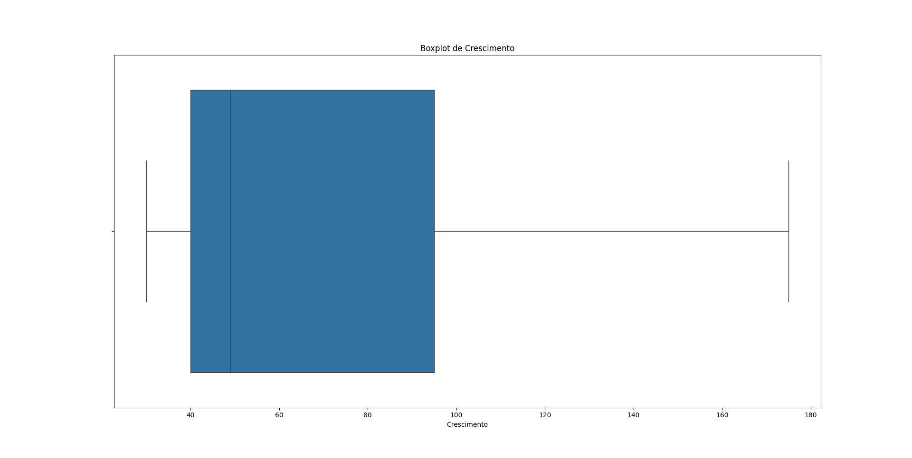

# Tratamento de dados do dataset
Na etapa anterior, eu mostrei como abrir um dataset com o pandas, e como visualizar ele usando gráficos, verificar se tem valores NaN ou Outliers, calcular médias moveis e correlação. **Agora nessa próxima etapa vou mostrar alguns tratamentos de dados que eu vou fazer nesse dataset.**

## Tratamento de Escala
Em alguns datasets, os valores das colunas podem ter valores bem grandes ou ter valores muito pequenos, que vão ser obviamente mais dificil de interpretar e ver com os olhos, e também, podem afetar a exibição de gráficos e modelos de Machine Learning. Por isso, se percebermos que o dataset tem valores em escalas muito grande ou muito pequenas, é necessário tratar isso, para deixar a informação mais clara. **Eu não vou tratar a escala do meu dataset por que eu criei ele numa escala que eu queria.** 

### Como tratar a Escala
Para tratar a escala podemos usar diferentes técnicas. Por exemplo, podemos dividir o valor da coluna que estamos tratando por um mesmo número fixo(por exemplo 10 ou 100), em cada uma das amostras, para diminuir a escala. Também podemos somar ou subtrair números fixos(como 1000 ou 100) para tentar elimitar números negativos por exemplo. 

Mais além dessas técnicas mais simples, podemos usar funções como as do Sklearn, como por exemplo, o MinMaxScaler da biblioteca Sklearn, que servem para normalizar escalas de valores nas amostras.

## Conversão de Datas e Textos
Também, podemos converter colunas que tenham valores de texto para números, por exemplo na codificação One Hot Enconding, que transforma variáveis categóricas em colunas contendo apenas zeros e uns.

Também podemos converter textos para datas, texto para números, ou números para texto, etc. Por exemplo, podemos converter o número do mês para o nome do mês. 

### Exemplo de conversão que eu fiz
```python

# Convetendo cada estação para um número
mapeamento = {'Verão': 1, 'Outono': 2, 'Inverno': 3, 'Primavera': 4}
dataset['Estacao_Numero'] = dataset['Estacao'].map(mapeamento)


# Convertendo o número do mes para o nome do mes
meses = {
    1: 'Janeiro', 2: 'Fevereiro', 3: 'Março', 4: 'Abril', 5: 'Maio',
    6: 'Junho', 7: 'Julho', 8: 'Agosto', 9: 'Setembro', 10: 'Outubro',
    11: 'Novembro', 12: 'Dezembro'
}

# Usando o dicionário para mapear os números para nomes
dataset['Nome_Mes'] = dataset['Mes'].map(meses)
```

**EXPLICAÇÂO: Com isso, eu criei duas novas colunas ao meu dataset: Estacao_Numero e Nome_Mes**


## Remover Outliers(valores extremos)
Na etapa anterior de análise exploratória, eu expliquei formas de identificar Outliers. Com isso, sabendo onde estão esses Outliers, podemos apagar eles do nosso dataset usando funções como o `drop` do pandas. É assim que se trata Outliers.

### Exemplo de como remover os Outliers do meu dataset
```python
#Agora vou remover os dois Outliers que eu coloquei propositalmente na etapa de criação do dataset
#Pra simplificar a explicação, como eu já sei que os Outliers tem valores maiores que 300, eu posso remover isso já!
print( 'QTDE AMOSTRAS COM CRESCIMENTO ACIMA DO MAXIMO', dataset[ dataset['Crescimento'] > 300 ]['Crescimento'].count() );

# Agora basta eu salvar esses outliers em uma variavel
outliers = dataset.loc[ dataset['Crescimento'] > 300 ]

# E remover essas linhas do dataset
dataset.drop( outliers.index, inplace=True );
```

Pronto! Agora esses 2 Outliers foram removidos. 

Eu expliquei na etapa anterior que podemos usar um Gráfico chamado de Box Plot para identificar Outliers. 
**Abaixo, eu mostrei um exemplo desse mesmo gráfico que usamos para identificar os Outliers, porém depois que os Outliers foram removidos com o código acima:**



**EXPLICAÇÂO DO GRÁFICO: Como voce pode ver, não aparecem mais nenhum valor fora da zona do gráfico. Ou seja, não está mais aparecendo nenhum Outlier, por que eu removi eles com o código acima. Não existem mais Outliers no dataset para serem mostrados.**
 

## Tratar valores NaN(valores faltando)
Na etapa anterior de análise exploratória, eu expliquei formas de identificar valores NaN. Com isso, sabendo quais são as colunas que tem valores faltando, podemos tratar elas substituindo esses valores faltantes por alguma coisa. Por exemplo, se em uma determinada coluna temos 200 números, e um deles é NaN(está faltando), podemos tirar a média dessa coluna, e substituir esses valores NaN pela média da própia coluna.

Também poderiamos substituir esses valores por um valor fixo, como por exemplo zero ou um.

Também poderiamos apagar essas amostras, se isso não foi afetar o dataset.

Também poderiamos usar regressão linear na coluna, para tentar estimar o valor que a coluna deveria ter.

Essas são algumas formas mais conhecidas de se tratar valores NaN. Cada um escolhe o que acha melhor.


