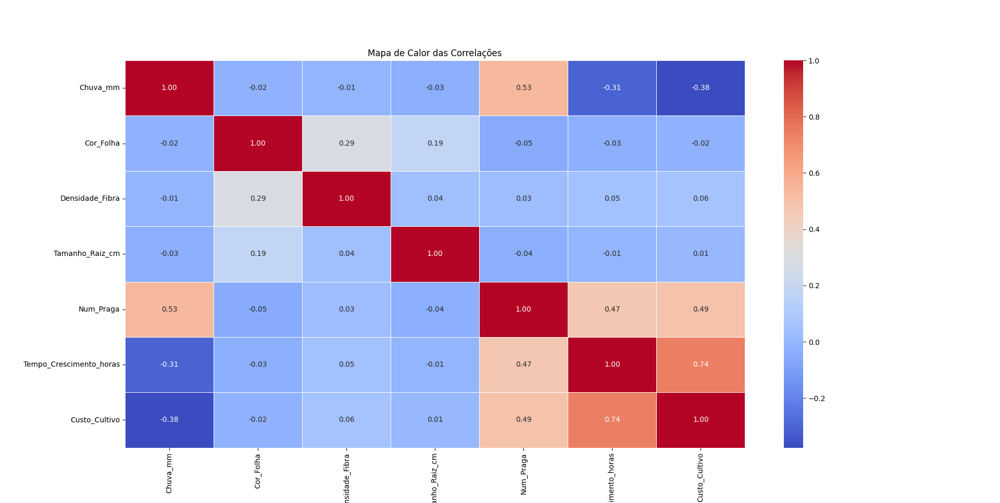
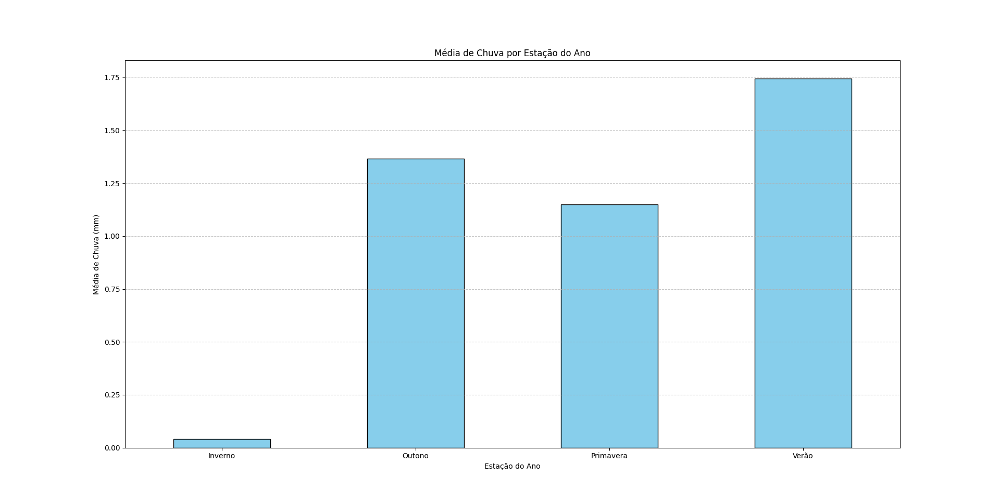
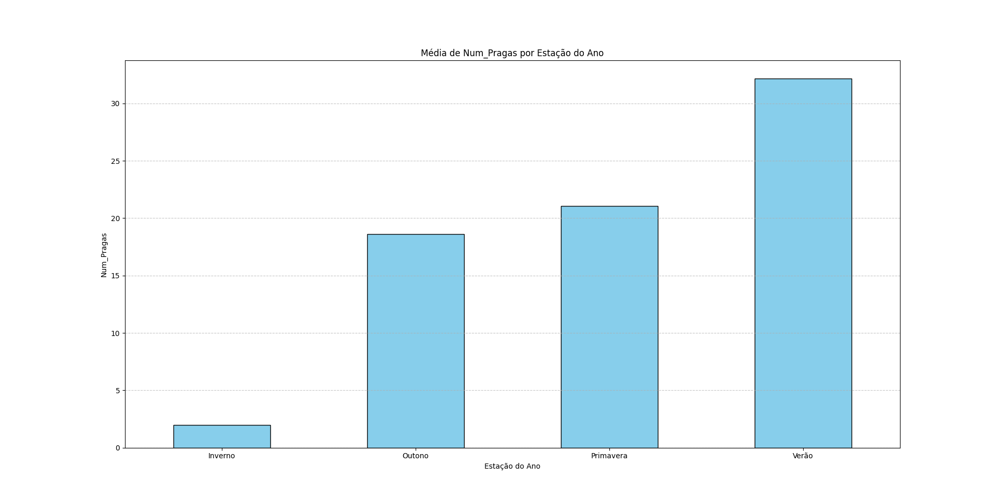
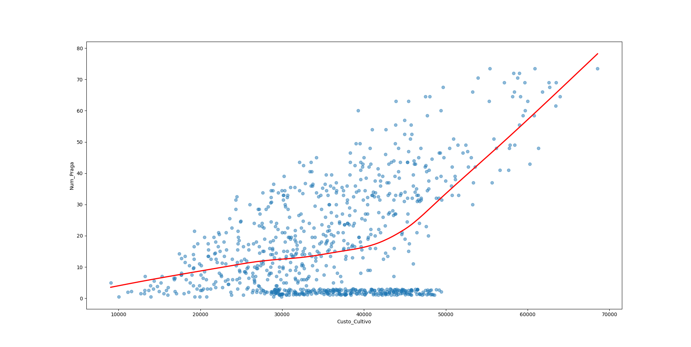

# Simplificação que eu fiz
Esse dataset que eu criei ele acabou ficando muito complexo, com escalas bem grandes, e foi muito trabalhoso de tratar.
Fiquei a semana toda, todo dia, tratando tudo isso.

Eu iria documentar todo processo de tratamento e normalização que eu segui, mais devido a alta complexidade do dataset, e de tantas coisas que eu precisei fazer, isso poderia confundir. Então, eu optei por apenas falar sobre o que eu fiz, mostrar alguns graficos, quais foram as dificuldades, a solução, e qual foi o resultado.

# Gráficos
**Os gráficos abaixo mostram como ficou o dataset depois dos tratamentos e simplificação que eu fiz.**

## Correlações entre as variaveis

**EXPLICAÇÂO: Como voce pode ver, o número de pragas aumenta o custo do cultivo e o tempo de crescimento da planta. Enquanto, as chuvas reduzem o custo de cultivo e tempo de crescimento.**

## Chuva por estação do ano

**EXPLICAÇÂO: Como voce pode ver, o inverno foi a estação do ano que choveu menos.**

## Pragas por estação do ano

**EXPLICAÇÂO: Como voce pode ver, o inverno foi a estação do ano que teve bem menas pragas.**

## Num_Pragas vs Custo_Cultivo

**EXPLICAÇÂO: Como voce pode ver, a medida que o número de pragas aumenta, o custo de cultivo tambem aumenta.**