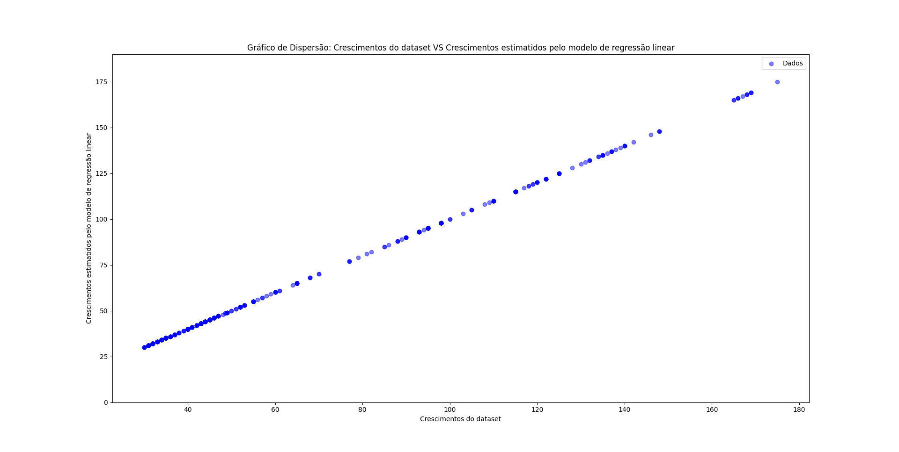

# Tópico anterior:
[Tópico anterior: Normalização, Escala e Tratamento de dados](../tratamento-dados/)

# Treinando um modelo de Machine Learning para fazer regressão do crescimeto das plantas do dataset

## Treinamento de um modelo de Machine Learning para fazer Regressão Linear
Nas etapas anteriores, eu criei um dataset, tratei ele, e agora vou treinar um modelo de regressão linear para estimar o Tempo de Crescimento da planta pelo Ano e Mês.

### Exemplo de código para treinar um modelo de regressão linaer
```python
import pandas as pd
import numpy as np
from sklearn.model_selection import train_test_split
from sklearn.preprocessing import OneHotEncoder, StandardScaler
from sklearn.pipeline import Pipeline
from sklearn.compose import ColumnTransformer
from sklearn.linear_model import LinearRegression

# Carregar os dados
df = pd.read_csv('../tratamento-dados/crescimento-soja-tratado.csv', sep=';');

# Separar variáveis explicativas e alvo
X = df.drop(columns=['Ano', 'Mes'])
y = df['Crescimento']

# Transformações para colunas categóricas e numéricas
categorical_features = ['Estacao']
numeric_features = ['Crescimento']

preprocessor = ColumnTransformer(
    transformers=[
        ('num', StandardScaler(), numeric_features),
        ('cat', OneHotEncoder(handle_unknown='ignore'), categorical_features)
    ]
)

# Criar pipeline com regressão linear
model = Pipeline([
    ('preprocessor', preprocessor),
    ('regressor', LinearRegression())
])

# Separar treino e teste
X_train, X_test, y_train, y_test = train_test_split(X, y, test_size=0.3, random_state=42)

# Treinar o modelo
model.fit(X_train, y_train)

# Avaliação
score = model.score(X_test, y_test)
print(f'R² do modelo: {score:.4f}')

crescimentosEstimados = model.predict(X_test)

print(crescimentosEstimados)

"""
Mostrando um gráfico de dispersão para ver a qualidade das estimativas do modelo
"""
import seaborn as sns
import matplotlib.pyplot as plt

# Criando o gráfico de dispersão
plt.scatter(x=y_test, y=crescimentosEstimados, color='blue', alpha=0.5, label='Dados')

# Adicionando rótulos e título
plt.xlabel('Crescimentos do dataset')
plt.ylabel('Crescimentos estimatidos pelo modelo de regressão linear')
plt.ylim(0, 190)
plt.title('Gráfico de Dispersão: Crescimentos do dataset VS Crescimentos estimatidos pelo modelo de regressão linear')
plt.legend()

# Exibindo o gráfico
plt.show()
```

Com esse código python acima, é possivel treinar um modelo de regressão linear para estimar o tempo de crescimento das plantas em determinado ANO E MÊS.

## Resultado das estimativas de Crescimento das plantas pelo modelo de regressão linear 


Note que o gráfico de dispersão acima mostra que os tempos de crescimento estimados pelo modelo de regressão linear construido no código python acima conseguiu acertar muito bem os tempos de crescimento das plantas do dataset, por que os pontos estão muito próximos, e dá pra ver uma reta se formar.

# Próximo tópico:
[Próximo tópico: Conclusão](../conclusao/)